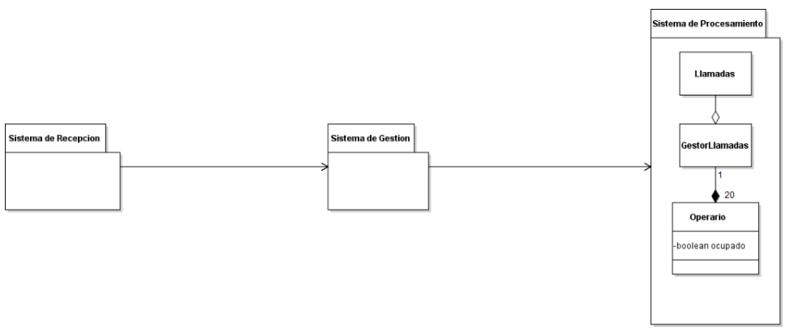
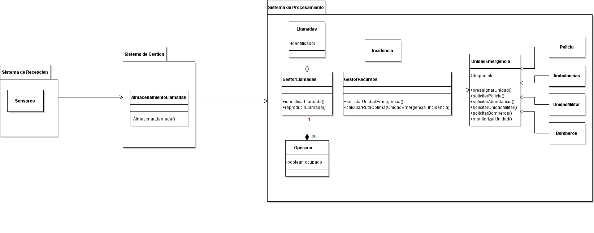

## ITERACIÓN 1

#### ADD-00:

| Short title of decision  |Captura de eventos inesperados |
| ------------- | ------------- |
| ID | ADD-00 |
| Date | 15/10/2019 |
| Creator of the decision | Borja Castro, Deborah Villanueva |
| Status | Accepted |
| Requirements (decision drivers)  | - RF000-Eventos inesperados  - RF007-Sensores  |
| Decision outcome (options selected)  | Estilo por eventos |
| Pros Opciones | - Detectan eventos inesperados  - Alerta al sistema de emergencias  |
| Cons Opciones | - Alto y continuo mantenimiento  - Posibilidad de fallos y ruptura  |
| Link to other decisions | ADD-00, ADD-01, ADD-02, ADD-03, ADD-04, ADD-05, ADD-06,  ADD-07, ADD-08, ADD-09, ADD-10, ADD-11 |
| Link to architecture artifacts | Arquitectura por eventos (observer)  |

#### ADD-01:

| Short title of decision  | Gestor de llamadas |
| ------------- | ------------- |
| ID | ADD-01 |
| Date | 15/10/2019 |
| Creator of the decision | Borja Castro, Deborah Villanueva |
| Status | Accepted |
| Requirements (decision drivers)  | RF001.Gestiónar llamadas RF001.2 Llamadas simultaneas RF001.3 Distribución de llamadas  |
| Decision outcome (options selected)  | Gestor de llamadas |
| Pros Opciones | - Engloba el amplio abanico de subsistemas  anidados  en lo referente a la gestión de llamadas  - Gestión ordenada  - Fácil escalado  - La generalización proporciona optimización  - Fácil administración y acceso  entre los subsistemas adheridos |
| Cons Opciones | - Menos particularización  - más lento por acceso  |
| Link to other decisions | ADD-02,ADD-03,ADD06 |
| Link to architecture artifacts | Arquitectura por eventos (observer) |
  
#### UML

 

## ITERACIÓN 2

#### ADD-02:

| Short title of decision  | Identificación de llamadas entrantes |
| ------------- | ------------- |
| ID | ADD-02 |
| Date | 16/10/2019 |
| Creator of the decision | Borja Castro, Deborah Villanueva |
| Status | Accepted |
| Requirements (decision drivers)  | - R001.1  Identificar de llamadas entrantes  - RF001.1.1 Gestionar incidencias internas  - RF001.4 Reproducción de llamadas   |
| Pros Opciones  | - Identificación inmediata de las llamadas  - Posible solución de una incidencia rápidamente  - Resolución de conflictos internos no conocidos  - Visualización identificada con voz de la llamada correspondiente  |
| Cons Opciones | - Amplia variedad de identificadores con resultante confusión |
| Link to other decisions | ADD-01, ADD-06 |

#### ADD-03:

| Short title of decision  | Gestión recursos activos |
| ------------- | ------------- |
| ID | ADD-03 |
| Date | 16/10/2019 |
| Creator of the decision | Borja Castro, Deborah Villanueva |
| Status | Accepted |
| Requirements (decision drivers)  | - RF002: Gestión de recursos activos - RF002.2 Preasignación  - F003 Monitorización emergencias|
| Pros Opciones | - Control del personal  necesario en cada momento de  cierta emergencia.  - Rapidez a la hora de facilitar los recursos puesto que  son pre asignados con antelación |
| Cons Opciones | - Posibilidad de recursos inactivos puesto que al estar  asignados una cantidad mínima de personal,  algunos no ejercen |
| Link to other decisions | ADD-01,ADD02, ADD06 |

#### ADD-04:

| Short title of decision  | Optimización de ruta |
| ------------- | ------------- |
| ID | ADD-04 |
| Date | 16/10/2019 |
| Creator of the decision | Borja Castro, Deborah Villanueva |
| Status | Accepted |
| Requirements (decision drivers)  | - RF002.1 Mejorar ruta |
| Alternative decisions (options) | Programas de terceros (como Google Maps o Waze) |
| Decision outcome (options selected)  | Optimización de ruta |
| Pros Opciones | Opcion1:  - Mayor rapidez para llegar al lugar  - Tráfico en tiempo real  Opcion2: - Económico |
| Cons Opciones | Opcion1: - Algoritmo complejo - Requiere de personal especializado para  desarrollarlo, optimizarlo y mantenerlo con continuidad - Precio elevado  Opción2: - Menos personalizable |
| Link to other decisions | ADD-03 |

#### UML

 
