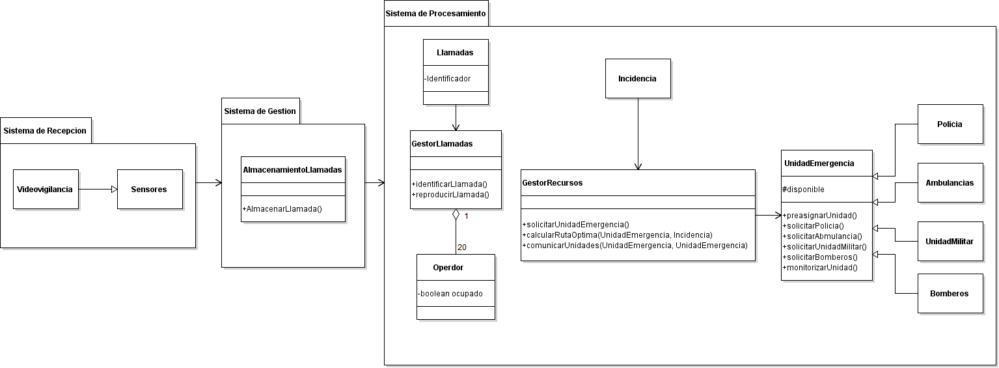

## ITERACIÓN 1

#### ADD-00:

| Short title of decision  |Captura de eventos inesperados |
| ------------- | ------------- |
| ID | ADD-00 |
| Date | 15/10/2019 |
| Creator of the decision | Borja Castro, Deborah Villanueva |
| Status | Accepted |
| Requirements (decision drivers)  | - RF000-Eventos inesperados  - RF007-Sensores  |
| Decision outcome (options selected)  | Estilo por eventos |
| Pros Opciones | - Detectan eventos inesperados  - Alerta al sistema de emergencias  |
| Cons Opciones | - Alto y continuo mantenimiento  - Posibilidad de fallos y ruptura  |
| Link to other decisions | ADD-00, ADD-01, ADD-02, ADD-03, ADD-04, ADD-05, ADD-06,  ADD-07, ADD-08, ADD-09, ADD-10, ADD-11 |
| Link to architecture artifacts | Arquitectura por eventos (observer)  |

#### ADD-01:

| Short title of decision  | Gestor de llamadas |
| ------------- | ------------- |
| ID | ADD-01 |
| Date | 15/10/2019 |
| Creator of the decision | Borja Castro, Deborah Villanueva |
| Status | Accepted |
| Requirements (decision drivers)  | RF001.Gestiónar llamadas RF001.2 Llamadas simultaneas RF001.3 Distribución de llamadas  |
| Decision outcome (options selected)  | Gestor de llamadas |
| Pros Opciones | - Engloba el amplio abanico de subsistemas  anidados  en lo referente a la gestión de llamadas  - Gestión ordenada  - Fácil escalado  - La generalización proporciona optimización  - Fácil administración y acceso  entre los subsistemas adheridos |
| Cons Opciones | - Menos particularización  - más lento por acceso  |
| Link to other decisions | ADD-02,ADD-03,ADD06 |
| Link to architecture artifacts | Arquitectura por eventos (observer) |
  
#### UML

 

## ITERACIÓN 2

#### ADD-02:

| Short title of decision  | Identificación de llamadas entrantes |
| ------------- | ------------- |
| ID | ADD-02 |
| Date | 16/10/2019 |
| Creator of the decision | Borja Castro, Deborah Villanueva |
| Status | Accepted |
| Requirements (decision drivers)  | - R001.1  Identificar de llamadas entrantes  - RF001.1.1 Gestionar incidencias internas  - RF001.4 Reproducción de llamadas   |
| Pros Opciones  | - Identificación inmediata de las llamadas  - Posible solución de una incidencia rápidamente  - Resolución de conflictos internos no conocidos  - Visualización identificada con voz de la llamada correspondiente  |
| Cons Opciones | - Amplia variedad de identificadores con resultante confusión |
| Link to other decisions | ADD-01, ADD-06 |

#### ADD-03:

| Short title of decision  | Gestión recursos activos |
| ------------- | ------------- |
| ID | ADD-03 |
| Date | 16/10/2019 |
| Creator of the decision | Borja Castro, Deborah Villanueva |
| Status | Accepted |
| Requirements (decision drivers)  | - RF002: Gestión de recursos activos - RF002.2 Preasignación  - F003 Monitorización emergencias|
| Pros Opciones | - Control del personal  necesario en cada momento de  cierta emergencia.  - Rapidez a la hora de facilitar los recursos puesto que  son pre asignados con antelación |
| Cons Opciones | - Posibilidad de recursos inactivos puesto que al estar  asignados una cantidad mínima de personal,  algunos no ejercen |
| Link to other decisions | ADD-01,ADD02, ADD06 |

#### ADD-04:

| Short title of decision  | Optimización de ruta |
| ------------- | ------------- |
| ID | ADD-04 |
| Date | 16/10/2019 |
| Creator of the decision | Borja Castro, Deborah Villanueva |
| Status | Accepted |
| Requirements (decision drivers)  | - RF002.1 Mejorar ruta |
| Alternative decisions (options) | Programas de terceros (como Google Maps o Waze) |
| Decision outcome (options selected)  | Optimización de ruta |
| Pros Opciones | Opcion1:  - Mayor rapidez para llegar al lugar  - Tráfico en tiempo real  Opcion2: - Económico |
| Cons Opciones | Opcion1: - Algoritmo complejo - Requiere de personal especializado para  desarrollarlo, optimizarlo y mantenerlo con continuidad - Precio elevado  Opción2: - Menos personalizable |
| Link to other decisions | ADD-03 |

#### UML

 

## ITERACIÓN 3

#### ADD-05:

| Short title of decision  | Sistema de videovigilancia |
| ------------- | ------------- |
| ID |  ADD-05 |
| Date | 22/10/2019 |
| Creator of the decision | Borja Castro, Deborah Villanueva |
| Status | Accepted |
| Requirements (decision drivers)  | - RF004 Video-vigilancia |
| Pros Opciones | - Control visual de los activos - Incremento de seguridad en las instalaciones |
| Cons Opciones | - Pueden ser hackeadas - Posible robo de privacidad - Mantenimiento económicamente elevado |

#### UML

## ITERACIÓN 4

#### ADD-06:

| Short title of decision  | Acceso a perfil |
| ------------- | ------------- |
| ID |  ADD-06 |
| Date | 23/10/19 |
| Creator of the decision | Borja Castro, Deborah Villanueva |
| Status | Accepted |
| Requirements (decision drivers)  | - RF006 Login |
| Pros Opciones | - Acceso a datos específicos para el usuario - Adaptación al entorno digital - Mejora de la experiencia de usuario |
| Cons Opciones | - Necesidad de una base de datos para  almacenar los usuarios almacenados |
| Link to architecture artifacts | PAQUETE: (Arquitectura por eventos (observer)) |

#### ADD-07:

| Short title of decision  | Creación de nodos funcionales |
| ------------- | ------------- |
| ID |  ADD-07 |
| Date | 23/10/19 |
| Creator of the decision | Borja Castro, Deborah Villanueva |
| Status | Accepted |
| Requirements (decision drivers)  | - RF009- Insuficientes nodos funcionales |
| Decision outcome (options selected)  | Creación de nodos funcionales |
| Pros Opciones | Nodos funcionales - Proporciona una estrategia de resolución de conflicto  en el acceso  de operadores aun no estando los  operadores disponibles, permitiendo la respuesta de las  peticiones de los usuarios - Aumentando la entrada de llamadas.  Contratación de  más operadores  - Más atención personalizada  - Mayor disponibilidad prestada a los usuarios  - Cercanía al ususario  Inclusión de la Inteligencia Artificial(IA) con Machine  Learning - Constante aprendizaje a cerca de las peticiones,  consecuentemente una mejor aplicación a futuras llamadas - Disminución de personal |
| Cons Opciones | Nodos funcionales - No hay atención personalizada - Hay un límite de respuestas, correspondiente a la  capacidad del servidor  Contratación de  más operadores - Elevar el coste - Proporcionar mayor espacio físico(instalaciones) - Mayor cantidad de nodos  Inclusión de la Inteligencia Artificial(IA) con Machine  Learning - Elevado coste - Mantenimiento - Personal especializado para desarrollarlo o personalizarlo |
| Link to other decisions |  |
| Link to architecture artifacts | Arquitectura por eventos (observer) |

#### UML

## ITERACIÓN 5

#### ADD-08:

| Short title of decision  | Cifrado propio de comunicación  |
| ------------- | ------------- |
| ID |  ADD-08 |
| Date | 23/10/19 |
| Creator of the decision | Borja Castro, Deborah Villanueva |
| Status | Accepted |
| Requirements (decision drivers)  | - RF010 Comunicación cifrada |
| Alternative decisions (options) | Encriptación de terceros |
| Decision outcome (options selected)  | Cifrado propio de comunicación |
| Pros Opciones | Cifrado propio de comunicación - Comunicación adaptada a organismos de defensa - Privacidad gubernamental - Seguridad de mensajes privados  Encriptación de terceros - Uso de claves ya proporcionadas - Más económico |
| Cons Opciones | Cifrado propio de comunicación - Actualización constante en el código de  encriptación - Crear el propio algoritmo de cifrado y la clave  correspondiente para descifrarlo - Personal especializado  Encriptación de terceros - Poca seguridad debido a la clave compartida |
| Link to other decisions | ADD00, ADD06, ADD03 |
| Link to architecture artifacts | UML iteración 5 (Sistema de Gestión)  |

#### ADD-09:

| Short title of decision  | Traductor de terceros |
| ------------- | ------------- |
| ID |  ADD-09 |
| Date | 29/10/19 |
| Creator of the decision | Borja Castro, Deborah Villanueva |
| Status | Accepted |
| Requirements (decision drivers)  | - RF011. Traducción |
| Alternative decisions (options) | Traductor de terceros terceros |
| Decision outcome (options selected)  | Traductor de terceros terceros |
| Pros Opciones | Traductor propio: - Comunicación internacional - Traducción precisa a profesionales en  lengua materna - Aprendizaje de termionología  especialista(tecnicismos)  Traductor de terceros: - Mas barato |
| Cons Opciones | Traductor propio: - Posible pérdida de información - Posible malinterpretación  Traductor de terceros: - Difícil modificación |
| Link to other decisions | ADD00, ADD03, ADD10 |
| Link to architecture artifacts | UML iteración 5 (Sistema de Gestión)|

#### ADD-10:

| Short title of decision  | Subscripción de usuario |
| ------------- | ------------- |
| ID |  ADD-10 |
| Date | 29/10/19 |
| Creator of the decision | Borja Castro, Deborah Villanueva |
| Status | Accepted |
| Requirements (decision drivers)  | - RF012 Subscripción - RF012.1Actualización de información |
| Pros Opciones | - Distribución de información a los usuarios - Información actualizada en tiempo real - Fácil, simple ordenado - Accesible  |
| Cons Opciones | - Dependencia de la conexión a internet - Personal técnico encargado de la elaboración de las noticias |
| Link to other decisions | ADD00, ADD ADD05, ADD06,ADD09 |
| Link to architecture artifacts | UML iteración 5 (Sistema de Gestión) |

#### UML

